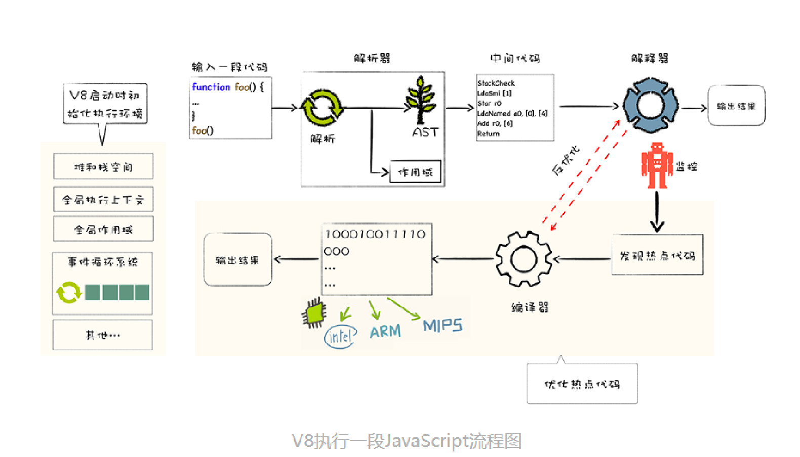

## V8 是如何执行 JavaScript 代码的呢

V8 是 JavaScript 虚拟机的一种。计算机执行高级语言有两种基本方式：解释执行和编译执行。解释执行和编译执行各有优缺点，解释执行启动速度快，但是执行时速度慢；编译执行启动速度慢，但是执行速度快。V8 采用的是混合编译执行和解释执行技术（即 JIT，Just In Time）。

## V8 是如何判断什么时候需要解释执行，什么时候需要编译执行的呢

V8 中有一个监控器，在解释执行过程中，如果某段代码的字节码被重复多次执行，监控器会将这段代码标记为热点代码。V8 会将这段代码的字节码传给优化编译器，编译成二进制代码，此时这段代码的执行效率会大幅提升。

但 JavaScript 是非常灵活的动态语言，对象结构和属性可以在运行时任意修改，经过优化编译过的代码只能针对某种固定的结构，一旦在执行过程中对象结构被动态修改，二进制代码就是无效代码了，此时优化编译器进行反优化操作，经过反优化的代码下次执行时会回退到解释器解释执行。
 
## V8 执行一段 JavaScript 代码的主要流程

- 初始化基础环境
- 解析源码生成 AST 和作用域
- 依据 AST 和作用域生产字节码
- 解释执行字节码
- 监听热点代码
- 优化热点代码为二进制机器代码
- 反优化生产的二进制机器代码

除了 JavaScript， 像 Python、PHP、Lua 都采用了 JIT 技术。

知乎上有一个关于 Chrome V8 的分析专栏，内容不错，且持续更新：https://www.zhihu.com/column/v8core
